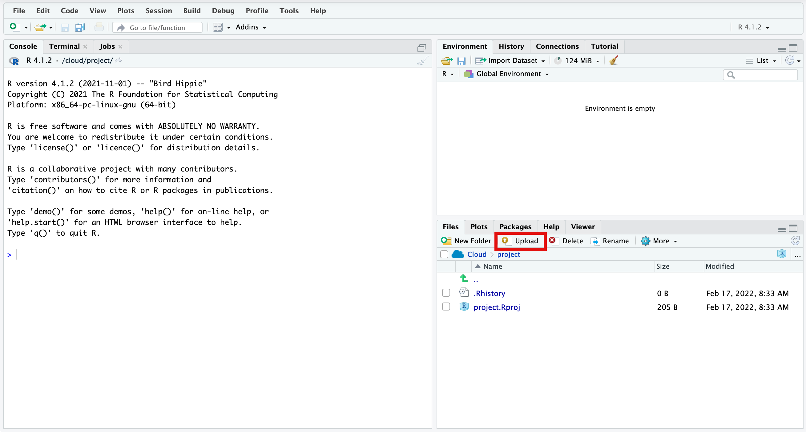
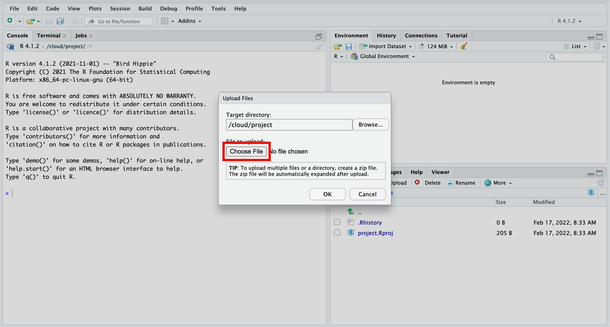
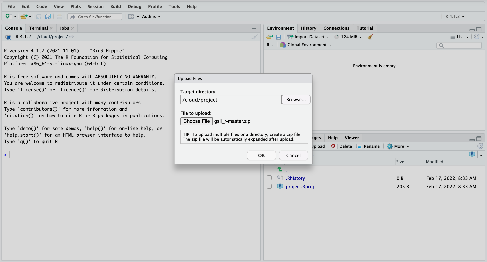
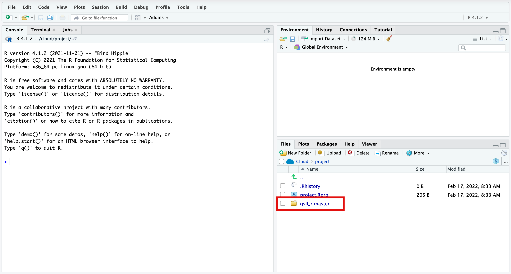
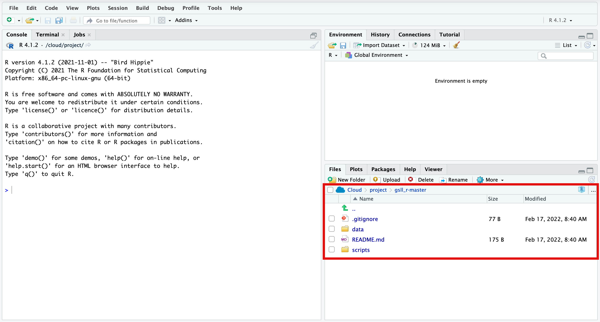

# Introduction to R

This repo contains data and scripts for the UMN Graduate Student Lunch and Learn workshop (February 17, 2022). Before our meeting, please make sure your Rstudio Cloud account is working (see instructions below).

### Downloading this repo

At the top of this page, you'll see the green box `Code`. Click there and then choose `Download Zip`.
> Please do not change the name of this file.

### Setting up Rstudio Cloud

Go to https://rstudio.cloud/ and log in with your UMN email and password (`Log In with Google`).

Click on `New Project` > `New RStudio Project` to create a project folder for this workshop. You can change its name by clicking in `Untitled Project` on the top left of your screen (if you don't see that, you'll probably see a target icon that you can click and change your project name).

### Uploading data into Rstudio Cloud

Once inside your Rstudio Cloud project, upload the `gsll_r-master.zip` file you downloaded from this repo. To do that, follow these instructions:

1. In the bottom right pane (File, Plots, Packages, Help, etc.), select the `Files` tab, and then click in `Upload`.

  

2. Click in `Choose File`, find the `gsll_r-master.zip` you just downloaded and click `Ok`.

  

  

  

3. You should now see a folder with all data and scripts for this workshop :)

  
